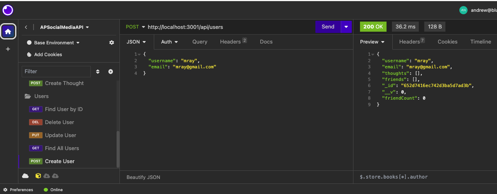

# APSocialNetworkAPI

Greetings! The APSocialNetworkAPI is a simple API built for a social network web application. With the application, users can share their thoughts, react to friends' thoughts, and create a friend list.

## Invoking the application

To invoke the application and start the server, simply run `npm install` followed by `npm start` in the terminal.

## Technology

The APSocialNetworkAPI employs Express.js for routing, a MongoDB database, the Mongoose Object Document Mapper, and Day.js for date rendering.

## Using

While this is not a deployed application, a user can add and manipulate data in the database using an API testing tool, such as Insomnia, to achieve the following:

* Invoke the application using the steps detailed above to sync the Mongoose models and the MongoDB database.
* Open API GET routes in Insomnia for users and thoughts and see these routes displayed in a formatted JSON.
* Successfully create, update, and delete users and thoughts by testing API POST, PUT, and DELETE routes.
* Successfully create and delete reactions to thoughts and add and remove friends to a user's friend list by testing API POST and DELETE routes.

## Screenshot

## Video Demonstration

[Here is a link to a video demonstration of the application!](https://watch.screencastify.com/v/mDs2D9oPZ98muZ3z7kyo)